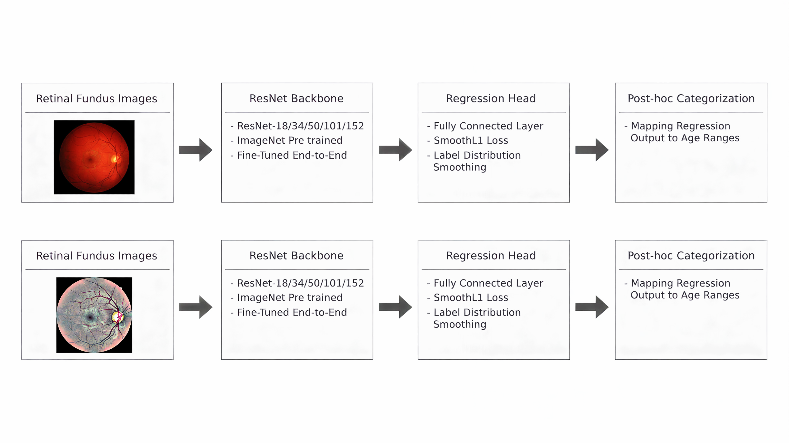

# Age Prediction and Categorization from Retinal Fundus Images Using Residual Neural Networks

This study investigates the behavior of ResNet architectures with different depths under varying input-variance conditions using retinal fundus images.

---

  

  Figure 1: the pipeline of this study

---

## Paper

- **Conference**: IISEC-26 International Conference  
- **Status**: Accepted & Presented  
- **Objective of the study**: To examine the relationship between model depth and performance, analyze the effect of image preprocessing on learning dynamics, and provide a comparative evaluation of high-variance vs. low-variance input conditions.

The full paper is available in this repository:

- `paper.pdf`

---
